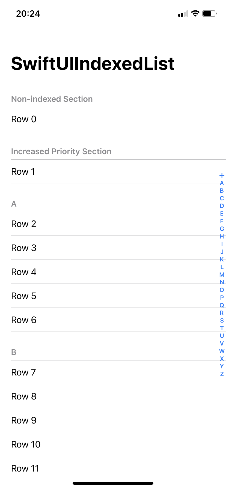

# SwiftUI Indexed List

Add an index bar to a SwiftUI `List` or `ScrollView`.



## Getting Started

Conform your data source to `Indexable` and `Identifiable`. Then replace `List` with `IndexedList`, or `ScrollView` with `IndexedScrollView`:

```swift
IndexedList(data) { element in
    Section {
        //Your section content
    } header: {
        //Your header content
            .id(element.id)
    }
}
```

## Overview

### Index

*struct* · A type that describes the appearance and behaviour of data in an index bar.
* `contentID`: The identifier of the view to scroll to.
* `displayPriority`: The display priority of the label. The system may consider the display priority during the layout of a truncated index bar.
    * `standard`: The standard display priority.
    * `increased`: The increased display priority. An increased priority does not guarantee the label will be displayed.
* `title`, `image` and `systemImage`: The parameters used to construct the label.

### Indexable

*protocol* · A type that can be displayed in an index bar.
* `index`: The appearance and behaviour in an index bar.

### IndexedList

*view* · A container that presents rows of data arranged in a single column.

Construct the `indices` and the list `content` manually, or provide `data` that conforms to `Indexable` along with `ElementContent` for each element.
* `accessory`: The scroll accessory to display in front of the list.
* `selection`: A binding that identifies selected rows.

### IndexedScrollView

*view* · A scrollable view.

Construct the `indices` and the scroll view's `content` manually, or provide `data` that conforms to `Indexable` along with `ElementContent` for each element.
* `accessory`: The scroll accessory to display in front of the scroll view.

### ScrollAccessory

*enum* · A scroll accessory displayed in front of a scrolling view.
* `automatic`: An index bar, or an interactive scroll indicator when no indices are provided.
* `indexBar`: An index bar.
* `scrollIndicator`: An interactive scroll indicator.
* `none`: No scroll accessory.

## Additional Features

### .indexBarBackground

*view modifier* · Content to layer behind any index bar within this view.
* `contentMode`: Defines how the content fills the available space of the index bar.
* `content`: The background content.

### indexBarInsets

*environment value* · The edge insets of the index bar in the scrolling container view.

## Requirements

* iOS 14.0+
* Xcode 13.0+

## Installation

* Install with [Swift Package Manager](https://developer.apple.com/documentation/xcode/adding_package_dependencies_to_your_app).
* Import `SwiftUIIndexedList` to start using.

## Contact

[@ciaranrobrien](https://twitter.com/ciaranrobrien) on Twitter.
